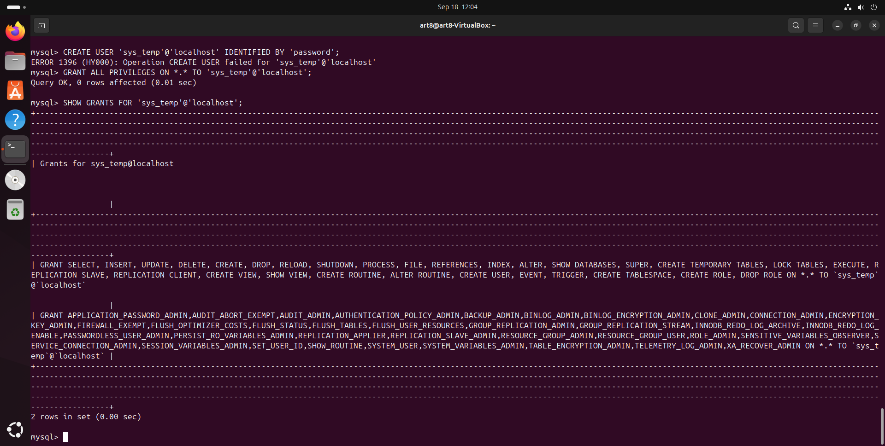
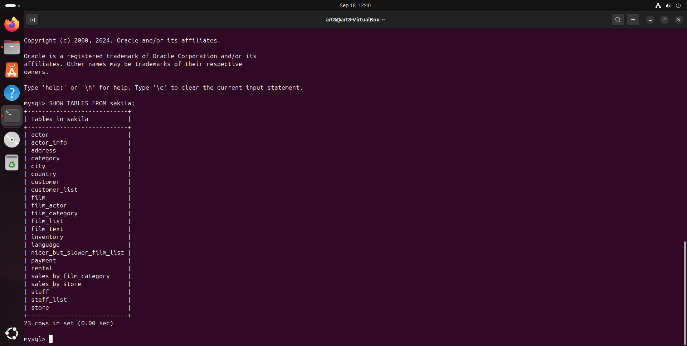
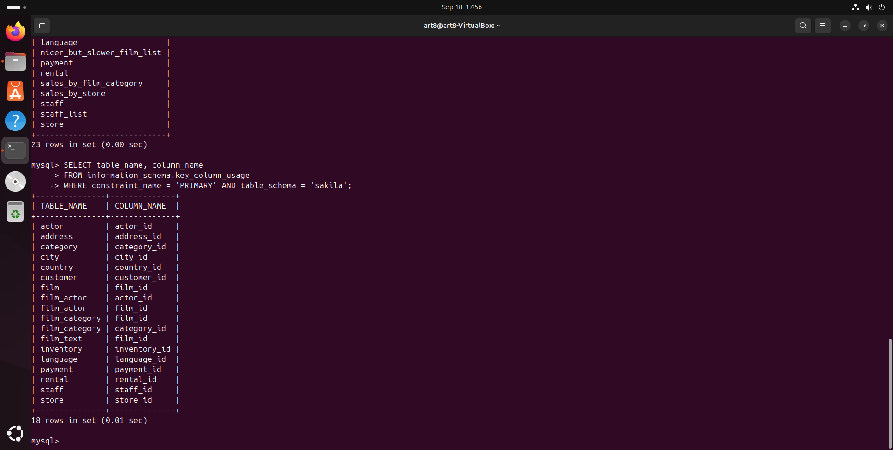

# Задание по MySQL

# Список запросов (простыня)

CREATE USER 'sys_temp'@'localhost' IDENTIFIED BY 'password';

GRANT ALL PRIVILEGES ON *.* TO 'sys_temp'@'localhost';

ALTER USER 'sys_temp'@'localhost' IDENTIFIED WITH mysql_native_password BY 'password';

CREATE DATABASE sakila;

mysql -u sys_temp -p sakila < ~/sakila-db/sakila-schema.sql

mysql -u sys_temp -p sakila < ~/sakila-db/sakila-data.sql

SHOW TABLES FROM sakila;

SELECT table_name, column_name FROM information_schema.key_column_usage WHERE constraint_name = 'PRIMARY' AND table_schema = 'sakila';

## Скриншоты

### 1. Права пользователя sys_temp

### 2. Список таблиц базы данных sakila

### 3. Первичные ключи таблиц

## Таблица с первичными ключами

Скачать таблицу в формате Excel можно по следующей ссылке: [sakila.xlsx](sakila.xlsx)
